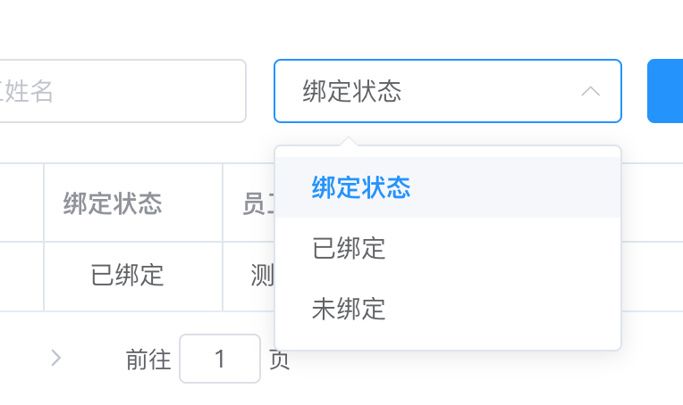
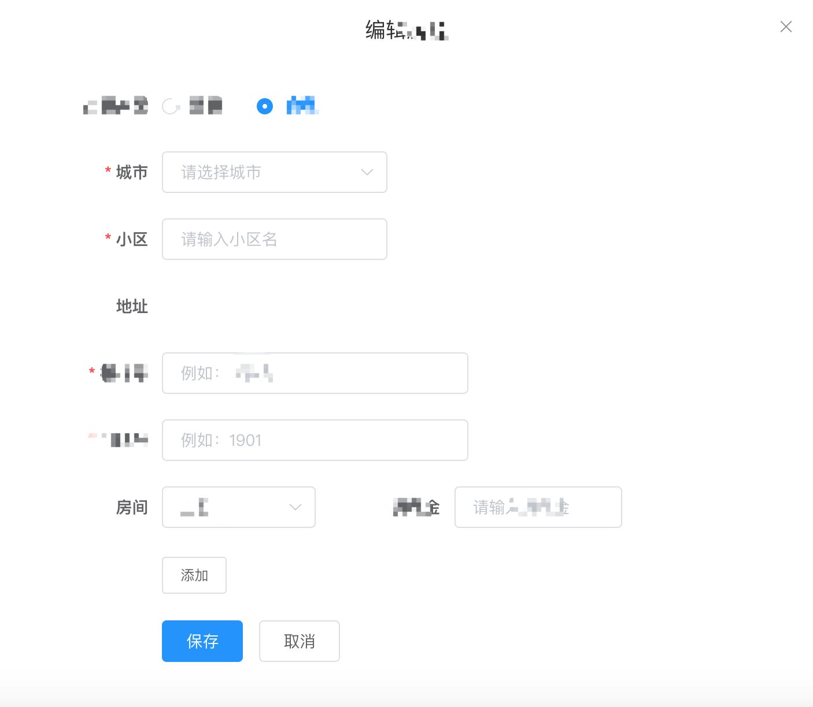

[官方指南](https://panjiachen.github.io/vue-element-admin-site/zh/guide/)

# 准备
## package.json
scripts节点：相当于在命令和里直接输入script中的命令
```json
{
   "scripts": {
    "dev": "vue-cli-service serve",
    "build:prod": "vue-cli-service build",
    "build:pre": "vue-cli-service build --mode pre", 
    "build:dev": "vue-cli-service build --mode dev",
    "preview": "node build/index.js --preview",
    "lint": "eslint --ext .js,.vue src",
    "test:unit": "jest --clearCache && vue-cli-service test:unit",
    "test:ci": "npm run lint && npm run test:unit",
    "svgo": "svgo -f src/icons/svg --config=src/icons/svgo.yml",
    "new": "plop"
  }
}
```
mode 后边的对应的是根目录.env.development,.env.pre等文件名
dependencies和devDependencies的区别


## eslint
禁用方法：
vue.config.js文件中增加如下代码
```javascript
   chainWebpack(config){
        config.module.rules.delete('eslint')
   } 

```
单个禁用可以修改.eslintrc.js

## plop
[说明](https://medium.com/@nicoespeon/plop-a-micro-generator-to-ease-your-daily-life-7767f0a34db)
自动生成文件名View Component 命令行创建工具


## mock.js
## webpack config
## dev-tools
[离线安装地址](https://github.com/vuejs/vue-devtools)
## store,directive,filter目录
---
# question:
1. this.$nextTick什么时候用？
2. Vue的Computed有什么用，解决了什么问题？
3. vuex有什么用，解决了什么问题？
4. sass有什么用，解决了什么问题？

# realworld question:

写法:
```javascript
export const binds = [
  {key: "", text: "绑定状态"},
  {key: "1", text: "已绑定"},
  {key: "0", text: "未绑定"}
];
export const bindsMap = makeMap(binds);
```

1. 当修改时候怎么绑定时候重新赋值Form对象
2. 新增时候 怎么做Form表单验证 动态添加出来的组件


 

   